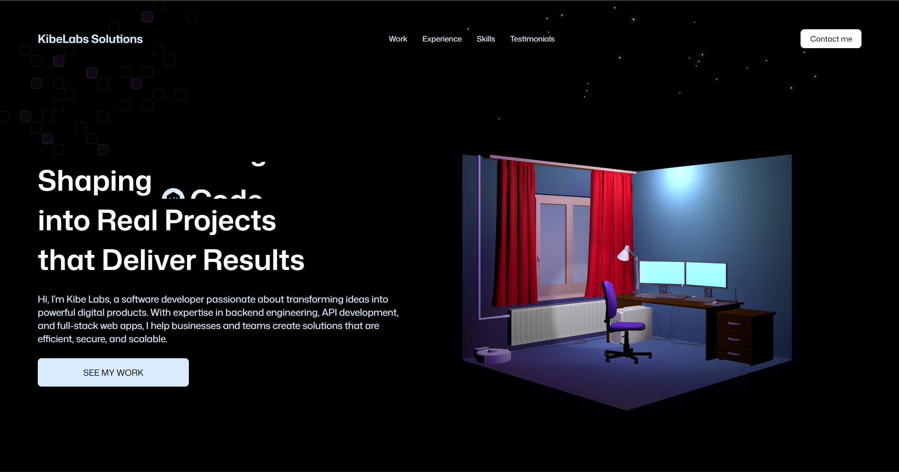
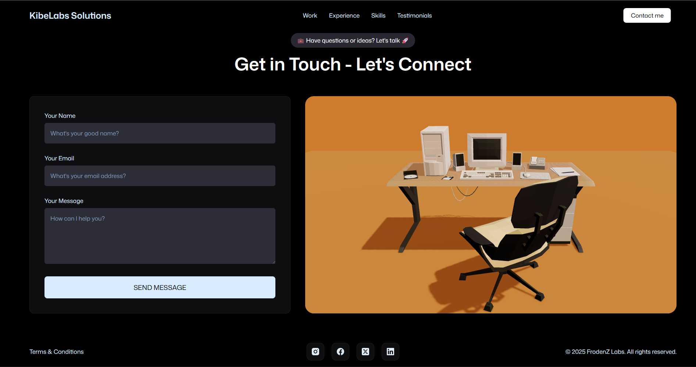

# 🌐 3D Portfolio Website

A modern, interactive **3D portfolio website** showcasing my work as a **Software Developer**.  
Built with **React, TailwindCSS, GSAP animations, and React Three Fiber**, this portfolio blends creative 3D visuals with smooth UI/UX to give visitors an immersive experience.  

---

## 🚀 Features
- ✨ **3D Hero Section** with animated model (`React Three Fiber`)  
- 🎭 **GSAP Animations** for smooth text & UI transitions  
- 📱 **Responsive Design** — optimized for desktop, tablet, and mobile  
- 📬 **Functional Contact Form** powered by **EmailJS**  
- 🛠️ **Projects Showcase** with animated cards  
- 📊 **Animated Counter** to highlight stats and achievements  
- 🌙 **Custom Theming** and reusable UI components  

---

## 🛠️ Tech Stack
- **Frontend:** React.js, Vite, TailwindCSS  
- **3D/Animations:** React Three Fiber, Drei, GSAP, Framer Motion  
- **Forms & Notifications:** EmailJS, React-Toastify  
- **Deployment:** Vercel / Netlify  

---

## ⚡ Getting Started

### 1. Clone the repo
```bash
git clone https://github.com/FrodenZLabs/3D-Portfolio.git
cd 3d-portfolio
```
### 2. Install dependencies
```bash
npm install
```
### 3. Set up environment variables
Create a .env file in the root directory:
```bash
VITE_APP_EMAILJS_SERVICE_ID=your_service_id
VITE_APP_EMAILJS_TEMPLATE_ID=your_template_id
VITE_APP_EMAILJS_PUBLIC_KEY=your_public_key
```
### 4. Run development server
```bash
npm run dev
```
---

# 📸 Preview


